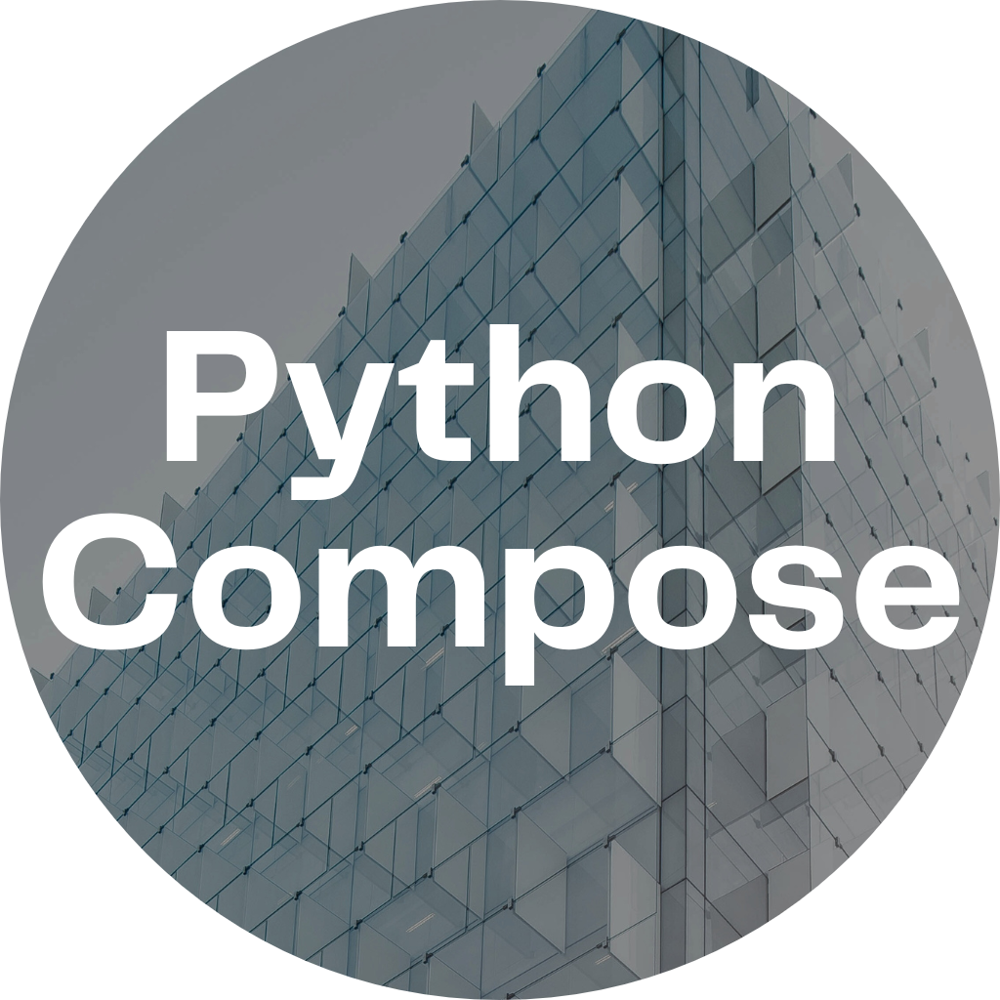

<p align="center">
	
	<h1 align="center">Python Compose</h1>
</p>

> A wrapper for Tkinter to allow for functional UIs in Python.

<h2> Table of Contents </h2>

- [Technologies Used](#technologies-used)
- [Example Usage](#example-usage)

## Technologies Used

<table>
<tbody>
	<tr align="center" valign="center">
		<td width="25.00000%" align="center">
			<a href="https://www.python.org/">
				
			</a>
		</td>		
		<td width="25.00000%" align="center">
			<a href="https://python-poetry.org/">
				
			</a>
		</td>		
		<td width="25.00000%" align="center">
			<a href="https://www.jetbrains.com/pycharm/">
				
			</a>
		</td>		
		<td width="25.00000%" align="center">
			<a href="https://git-scm.com/">
				
			</a>
		</td>		
	</tr>
	<tr align="center" valign="center">
		<td width="25.00000%" align="center">
			<a href="https://www.python.org/">
				<b>
					Python
				</b>
			</a>
		</td>
		<td width="25.00000%" align="center">
			<a href="https://python-poetry.org/">
				<b>
					Poetry
				</b>
			</a>
		</td>
		<td width="25.00000%" align="center">
			<a href="https://www.jetbrains.com/pycharm/">
				<b>
					PyCharm
				</b>
			</a>
		</td>
		<td width="25.00000%" align="center">
			<a href="https://git-scm.com/">
				<b>
					Git
				</b>
			</a>
		</td>
	</tr>
</tbody>
</table>

## Example Usage

```python
pc_tk(
	style_bundle=PcStyleBundle()
	.set_width(512)
	.set_height(512),
	title="Example Application",
	child_factories=[
		lambda p: pc_scrollable_frame(
			style_bundle=PcStyleBundle()
			.set_fill(customtkinter.X),
			parent=p,
			orientation="vertical",
			child_factories=[
				lambda p: pc_button(
					style_bundle=PcStyleBundle(),
					parent=p,
					string_var=PcStringVar("Button"),
					command=lambda: print("Button Pressed"),
				),
			],
		)
	],
)

```
